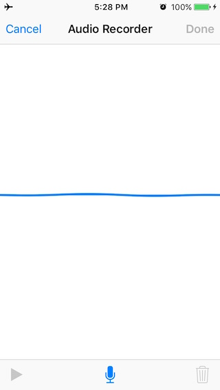
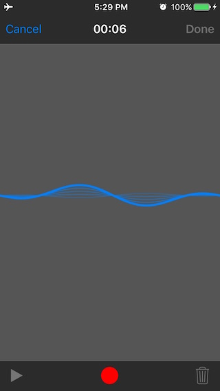
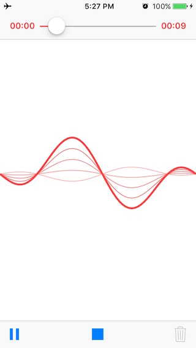
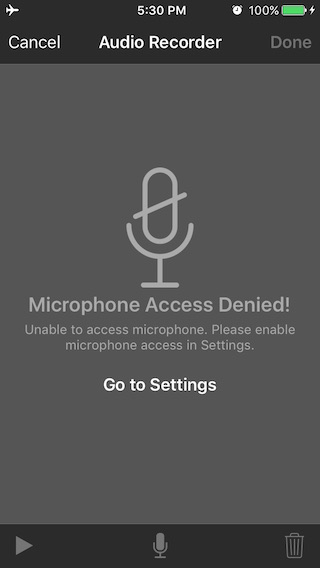

<p align="center">
  
</p>
<H1 align="center">IQAudioRecorderController</H1>

`IQAudioRecorderController` is a drop-in universal library allows to record audio within the app with a nice User Interface. There are also optional callback delegate methods to return recorded file path.

## Screenshot





## Cocoapod:-

pod 'IQAudioRecorderController'

## Supported format
Currently `IQAudioRecorderController` only support **.m4a** file format.

## Customisation
There are optional properties to customise the appearance according to your app theme.

***UIBarStyle barStyle***
Library support light and dark style UI for user interface. If you would like to present light style UI then you need to set barStyle to UIBarStyleDefault, otherwise dark style UI is the default.

***UIColor *normalTintColor***
This tintColor is used for showing wave tintColor while not recording, it is also used for top navigationBar and bottom toolbar tintColor.

***UIColor *highlightedTintColor***
Highlighted tintColor is used when playing recorded audio file or when recording audio file.


## How to use
```
#import "IQAudioRecorderController.h"

@interface ViewController ()<IQAudioRecorderControllerDelegate>
@end

@implementation ViewController

- (void)recordAction:(id)sender
{
    IQAudioRecorderController *controller = [[IQAudioRecorderController alloc] init];
    controller.delegate = self;
//    controller.barStyle = UIBarStyleDefault;
//    controller.normalTintColor = [UIColor magentaColor];
//    controller.highlightedTintColor = [UIColor orangeColor];
    [self presentViewController:controller animated:YES completion:nil];
}

-(void)audioRecorderController:(IQAudioRecorderController *)controller didFinishWithAudioAtPath:(NSString *)filePath
{
  //Do your custom work with file at filePath.
}

-(void)audioRecorderControllerDidCancel:(IQAudioRecorderController *)controller
{
  //Notifying that user has clicked cancel.
}

@end
```

## Attributions

Thanks to [Stefan Ceriu](https://github.com/stefanceriu) for his brilliant [SCSiriWaveformView](https://github.com/stefanceriu/SCSiriWaveformView) library.

## LICENSE

Distributed under the MIT License.

## Contributions

Any contribution is more than welcome! You can contribute through pull requests and issues on GitHub.

## Author

If you wish to contact me, email at: hack.iftekhar@gmail.com
