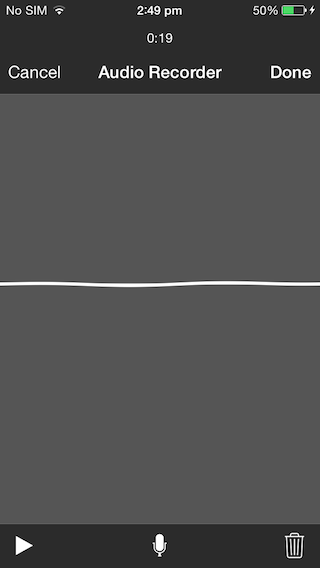

<p align="center">
  
</p>
<H1 align="center">IQAudioRecorderController</H1>

IQAudioRecorderController is a drop-in universal library allows to record audio within the app with a nice User Interface. The Audio Recorder produced the .m4a file and returns the path via it's delegate methods.

## Screenshot



## How to use
```
#import "IQAudioRecorderController.h"

@interface ViewController ()<IQAudioRecorderControllerDelegate>
@end

@implementation ViewController

- (void)recordAction:(id)sender
{
    IQAudioRecorderController *controller = [[IQAudioRecorderController alloc] init];
    controller.delegate = self;
    [self presentViewController:controller animated:YES completion:nil];
}

-(void)audioRecorderController:(IQAudioRecorderController *)controller didFinishWithAudioAtPath:(NSString *)filePath
{
  //Do your custom work with file at filePath.
}

-(void)audioRecorderControllerDidCancel:(IQAudioRecorderController *)controller
{
  //Notifying that user has clicked cancel.
}

@end
```

## Attributions

Thanks to [Stefan Ceriu](https://github.com/stefanceriu) for his brilliant [SCSiriWaveformView](https://github.com/stefanceriu/SCSiriWaveformView) library.

## LICENSE

Distributed under the MIT License.

## Contributions

Any contribution is more than welcome! You can contribute through pull requests and issues on GitHub.

## Author

If you wish to contact me, email at: hack.iftekhar@gmail.com
